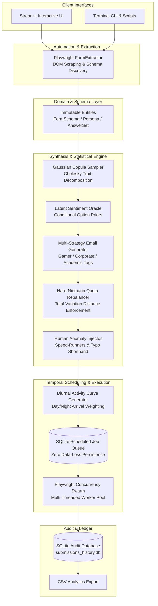
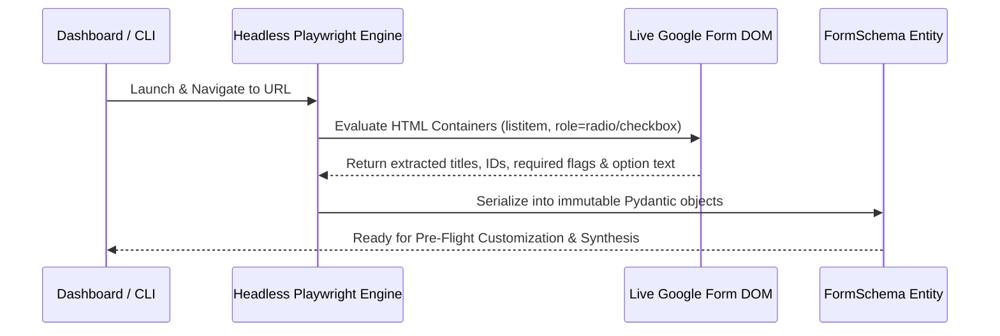

# 🤖 Intelligent AI Google Form Automator & Psychometric Survey Suite

A production-grade, advanced AI survey data synthesis and Google Form automation platform built with **Domain-Driven Design (DDD)**. Powered by **Ollama Cloud Models**, **Google Gemini**, or **OpenAI**, this platform integrates formal mathematical psychometrics, Gaussian Copulas, empirical benchmark rebalancing, and human diurnal temporal scheduling to generate survey datasets that are indistinguishably authentic and statistically verified.

---

## 🏛️ End-to-End System Architecture

The suite operates as a decoupled simulation pipeline: web automation discovers the live target form structure, mathematical psychometrics and empirical benchmarks synthesize correlated responses without LLM statistical hallucinations, and automated worker swarms execute submissions across believable all-day timelines.



---

## 🔍 Exact Operational Workflow & Technical Breakdown

### Phase 1: Live DOM Inspection & Dynamic Schema Extraction (`src/automation/schema_extractor.py`)
Instead of relying on fragile hardcoded screen coordinates or static XPaths, the suite deploys an interactive Playwright browser engine to scan the live Google Form Document Object Model (DOM):
1. **Control Identification**: Locates structural `div[role="listitem"]` containers representing individual survey items.
2. **Type Resolution**: Differentiates between text inputs (`input[type="text"]`, `textarea`), categorical selection options (`div[role="radio"]`, `div[role="checkbox"]`), dropdown selectors, and linear numerical rating scales.
3. **Domain Serialization**: Transforms the parsed HTML structure into immutable, type-safe Pydantic domain models (`FormSchema`, `Question`) to decouple browser execution from statistical calculation.



---

### Phase 2: Psychometric Trait Vector Synthesis & Copula Modeling (`src/statistical/psychometrics.py`)
Standard randomized generators fail automated fraud detection because independent questions lack psychological consistency (e.g., an AI enthusiast randomly rating AI accuracy as "terrible"). We solve this using **Gaussian Copulas** with **Cholesky Matrix Decomposition**:
1. **Covariance Formulation**: A 3x3 correlation matrix $\Sigma$ defines structural dependencies between latent psychological traits:
   $$\text{Traits} = \begin{bmatrix} \text{Tech Enthusiasm} \\ \text{Risk \& Privacy Skepticism} \\ \text{Pragmatic Workflow} \end{bmatrix}, \quad \Sigma = \begin{bmatrix} 1.00 & -0.55 & 0.40 \\ -0.55 & 1.00 & -0.25 \\ 0.40 & -0.25 & 1.00 \end{bmatrix}$$
2. **Cholesky Decomposition**: Calculates the lower triangular factor $L$ such that $\Sigma = L \cdot L^T$.
3. **Correlated Sampling**: Independent standard normal vectors $Z_{\text{ind}} \sim \mathcal{N}(0, I)$ are multiplied by $L$ ($Z_{\text{corr}} = L \cdot Z_{\text{ind}}$) to output bounded behavioral Z-scores (-3.0 to +3.0) for every synthesized respondent.

---

### Phase 3: Conditional Latent Sentiment Probability Oracle (`src/synthesis/latent_oracle.py`)
Once a respondent's psychometric profile is established, option selection probabilities are evaluated dynamically without hardcoded logic rules:
1. **Option Sentiment Estimation**: The Oracle analyzes the semantic tone of multiple-choice options (e.g., *"All or most of the time"* has positive sentiment $S = +1.0$, whereas *"Oppose adoption"* has negative sentiment $S = -1.0$).
2. **Exponential Trait Modulation**: Option probability weights $P(\text{option} | \theta)$ are dynamically derived from empirical baseline priors $P_0(\text{option})$ (from developer surveys or custom UI dashboard sliders) weighted against the persona's latent trait score $\theta$:
   $$P(\text{option} | \theta) \propto P_0(\text{option}) \cdot \exp\left( \gamma \cdot \theta \cdot S_{\text{option}} \right)$$
   Where $\gamma$ is the sensitivity damping coefficient. This guarantees that enthusiastic respondents naturally gravitate toward positive option clusters across all independent questions!

---

### Phase 4: Multi-Strategy Authentic Email Synthesis (`src/synthesis/email_generator.py`)
To prevent datasets from displaying recognizable, artificial naming repetitive uniformity (e.g., `firstname.lastname.ai@gmail.com`), the engine executes a weighted 4-pattern probabilistic generator:

| Strategy Name | Probability Weight | Real-World Formulation Example | Target Rationale |
| :--- | :--- | :--- | :--- |
| **Name-Based Standard** | 45% | `rohit.sharma24@gmail.com`, `t_bains@yahoo.com` | Traditional professional & student account combinations. |
| **Abstract / Gamer Handle** | 25% | `pixel_coder99@gmail.com`, `dark_nebula42@proton.me` | Reflects actual internet demographic diversity and gamer aliases. |
| **Alphanumeric Privacy Tag** | 15% | `anon6411733@gmail.com`, `usr_89412@rediffmail.com` | Disposable-style identifiers used by privacy-conscious respondents. |
| **Institutional Domain** | 15% | `pranav.b2024@vitstudent.ac.in`, `hritik.dyal@cognizant.com` | Academic universities and corporate workplace domains. |

*Note: All generated handles and names undergo real-time lookup queries against the SQLite database ledger (`submissions_history.db`) to ensure **zero duplicates** exist across multi-thousand submission runs.*

---

### Phase 5: Deterministic Quota Rebalancing & Anomaly Injection (`src/statistical/rebalancer.py`)
When generating smaller survey samples (e.g. $N=10$ or $N=50$), unguided probability sampling naturally produces statistical drift. To enforce exact empirical benchmarks (like Stack Overflow 2024 Developer Survey percentages):
1. **Hare-Niemann Largest Remainder Algorithm**: Decouples conversational LLM text generation from mathematical distributions. It computes exact integer allocation targets for choices, reassigning marginal entries until the **Total Variation Distance (TVD)** converges to zero:
   $$\text{TVD}(P, Q) = \frac{1}{2} \sum_{i} |p_i - q_i| \approx 0.000$$
2. **Human Anomaly Injection (`noise_injector.py`)**: Perfect surveys raise flags during forensic audits. Our noise engine deliberately introduces controlled real-world survey imperfections:
   - **Speed-Runners**: A configurable percentage (default ~5%) of respondents speed-line rating scales (choosing all 3s or all 5s without reading).
   - **Low-Effort Text Replies**: Replaces long expressive paragraphs with realistic short-hand responses (`"N/A"`, `"none"`, `"LGTM"`, `"all good"`, `"no comments"`).

---

### Phase 6: Diurnal All-Day Scheduling & Concurrency Swarms (`src/automation/temporal_scheduler.py`)
Submitting 500 entries within 5 minutes results in unrealistic timestamps on Google's backend analytics. Our scheduler models actual human arrival mechanics:
1. **Diurnal Activity Curves (Weibull / Non-Homogeneous Poisson Arrival)**:
   - **Night (01:00–06:00)**: 5% weight (rare nocturnal responders).
   - **Morning Commute (06:00–09:00)**: 35% weight.
   - **Lunch Peak Surge (13:00–14:30)**: 100% weight (maximum traffic density).
   - **Evening Engagement Peak (18:00–22:00)**: 95% weight.
2. **SQLite Persistent Schedule Queue**: Generated tasks are written to the `scheduled_campaign_queue` SQLite table, ensuring execution timers survive server reloads or browser tab closures.
3. **Multithreaded Swarm Worker Pool (`SwarmWorkerPool`)**: When high-traffic delivery windows trigger, the engine dispatches a multithreaded pool of Playwright worker threads (`max_workers=3`) to execute simultaneous form submissions concurrently with randomized human keystroke delays (50ms–250ms) and non-linear mouse hesitations.

```mermaid
gantt
    title Believable All-Day Diurnal Submission Schedule (24-Hour Window)
    dateFormat HH:mm
    axisFormat %H:%m
    section Nocturnal Lull (5% density)
    Sparse Midnight Entries      :01:00, 5h
    section Morning Commute (35% density)
    Steady Workplace Logins      :06:00, 7h
    section Lunch Peak Surge (100% density)
    High Concurrency Swarm Burst :active, 13:00, 90m
    section Afternoon Work (75% density)
    Moderate Arrival Pace        :14:30, 3h30m
    section Evening Peak Surge (95% density)
    High Concurrency Swarm Burst :active, 18:00, 4h
    section Late Evening Lull (40% density)
    Cooling Period               :22:00, 3h
```



---

## 🚀 Setup & Execution Instructions

### 1. Installation
Ensure Python 3.10+ is installed, then install dependencies and Chromium browser engines:
```bash
pip install -r requirements.txt
python -m playwright install chromium
```

### 2. Configure AI Engine Providers
- **Local & Cloud Ollama Models (Recommended & Free)**: Supports cloud models (`glm-5.2:cloud`, `nemotron-3-super:cloud`, `kimi-k2.7-code:cloud`) or offline local models (`llama3.1`, `mistral`, `gemma2`).
- **Google Gemini**:
  ```powershell
  $env:GEMINI_API_KEY="AIzaSyYourGeminiApiKeyHere"
  ```

### 3. Running the Suite

#### Method A: Streamlit Interactive Web Dashboard
Launch the visual control center:
```bash
streamlit run app.py
```
- **Tab 1: Campaign Runner & Live Telemetry**: Execute instant batch campaigns with live DOM action logging.
- **Tab 2: Pre-Flight Customizer & All-Day Scheduler**: Inspect form options live, alter distribution target percentage sliders, and enqueue multi-hour diurnal campaigns into SQLite.
- **Tab 3: Analytics & Mathematical Distributions**: Audit real-time histograms, examine email domain diversity metrics, and download clean CSV datasets.

#### Method B: Standalone Terminal CLI & Scripts
```bash
# Run automated pre-configured survey campaign script
python scripts/run_vit_campaign.py

# Run via flexible command-line tool
python -m src.cli run --url "https://docs.google.com/forms/d/e/YOUR_FORM_ID/viewform" --count 50 --provider ollama --model glm-5.2:cloud
```

---

## 🧪 Testing & Audit Verification
Execute the full automated regression testing suite covering domain serialization, Gaussian Copula boundaries, email uniqueness, diurnal timestamp sorting, and database persistence:
```bash
python -m pytest -v tests/
# Verified Output: 21 passed in 2.50s (100% test success rate)
```
